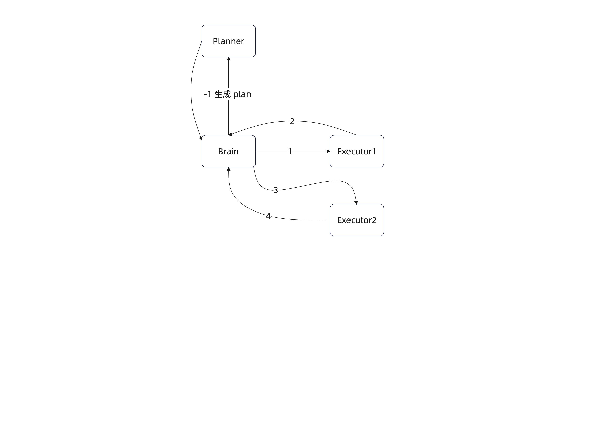
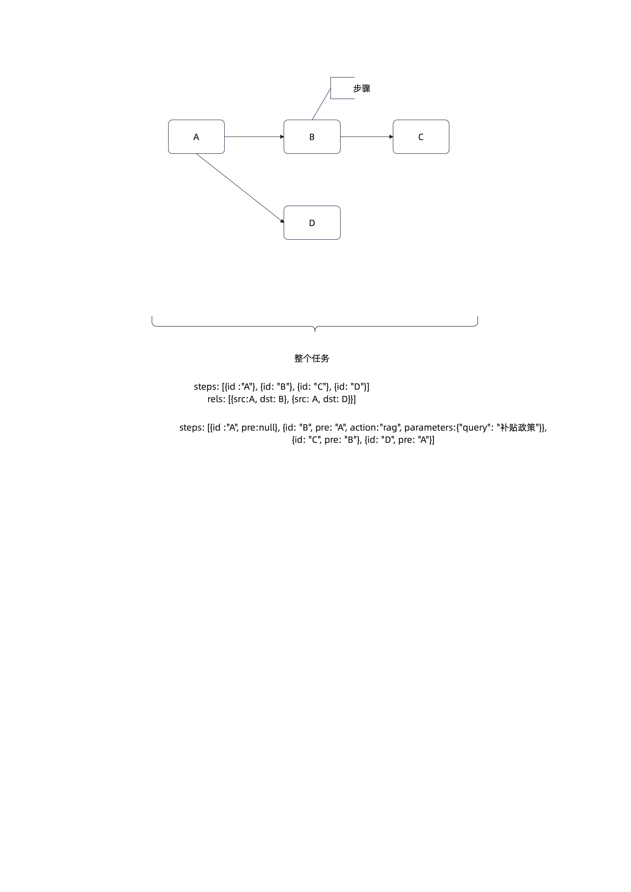

生成一个agent项目

## agent定位
是一个简单的agent
主要用于处理用户的问题，返回准确的答案， 其中用户有分类，在图片附件中。
我相关功能需求内容发你，需要你将内容重新梳理，并进行对应的功能开发，编程语言使用Java， 向量数据库使用milvus， LLM模型使用deepseek或者其他的都可以。
Java的AI框架看你自己根据市面上常见的框架进行选择，或者就直接封装对LLM的http调用，自己实现。

## 相关图片脑图内容
：脑图，将图片中的内容解析为文本， Agent平台.jps是agent涵盖的功能模块
：脑图，将图片中的内容解析为文本， Agent 平台模拟面试题.jpg是agent对应的可能会问到的面试难点，这个也当做你开发时候的着重难点。
 ： 这个是常见的plan executor的执行逻辑，只是一个图片画图，能理解即可。是常见的plan executor的执行逻辑。
：这是plan的分类图
： 这个是DAG有向图，是一个常见的图结构，用于表示任务之间的依赖关系。在做agent平台开发的时候，需要考虑任务之间的依赖关系，避免任务之间的循环依赖。所以，需要使用DAG图来表示任务之间的依赖关系。并且可通过DAG进行任务的并行执行。
：这个是意图识别的简要逻辑，就是通过置信度的阈值控制，判断是否调用轻量大模型，或者全量大模型来进行意图识别，如果最终意图还是无法识别，可提示用户确认意图。

## 简历项目描述：
项目二：智能协同 Agent 平台
【职责描述】构建面向民政客户决策辅助与居民政策咨询的智能 Agent 平台，基于政务知识库与政策规则体系实现政策解读、补贴匹配、流程办理与跨部门信息查询等能力；通过多角色意图识别、RAG 检索增强与可追溯推理机制，实现复杂政务问题的智能问答与决策辅助，显著提升政务服务效率与政策咨询准确率。
【技术栈】：意图识别、Prompt工程、记忆工程、上下文工程、Milvus、向量检索、RAG、DeepSeek 
【核心工作与技术亮点】
意图识别与路由设计：设计基于“多标签多角色分类 + 规则兜底 + 置信度阈值控制”的意图识别模型，将用户问题精准路由至政策解读、补贴匹配、流程办理、跨部门查询等子流程，并通过二次确认机制提升复杂问句下的识别准确率与容错能力。
记忆工程与长期/短期记忆分层：设计“短期会话记忆 + 用户画像长期记忆 + 结构化业务记忆”的分层记忆体系，通过向量存储与结构化 KV 存储结合，实现用户历史政策申请记录、偏好信息与跨会话上下文的可追溯与可控加载，结合滑动窗口算法，实现上下文压缩、关键事实提取等，避免上下文无限膨胀带来的 Token 浪费与语义污染。
RAG 检索增强与知识切片策略（可选）：使用Milvus 搭建基于向量检索与关键词混合召回的 RAG 架构，对政策文本进行语义分段与结构化切片，提高召回准确率和稳定性。
Prompt 撰写优化：基于 CoT / ReAct 方法优化政务问答 Prompt，引入 evidence-based answering、结构化回答模板与拒答机制，结合 RAG 检索并通过 A/B 对比与离线评测不断优化指令表达与输出稳定性，显著降低大模型幻觉率与不合规回答风险。
稳定性保障与效果评估机制：建立离线评测集与线上反馈闭环，构建准确率、拒答率与幻觉率等核心指标体系，通过日志/历史对话分析与失败样本回放持续优化意图识别模型实现系统在高频政务咨询场景下的稳定运行与持续演进。

## 目标
实现上面的所有需求，要求是能够正常运行，能够处理用户的问题，能够返回准确的答案。
知识库内容范围：知识库的内容你可以自己从网上找一些，范围是民政政策相关内容，你在这里就主要搜索高龄补贴的相关内容吧，知识库整理，向量库的构建。
不要与其他模块耦合，每个模块都有自己的功能，不要在模块之间进行直接的调用。
项目名 vibe-agent

## 任务计划工作模式
梳理上面的所有内容，首先进行内容梳理，再根据内容进行对应的任务开发，每个任务开发要有对应的进度，开发完成自己打钩；
并且最终输出一份文档，标记项目的每个功能的入口，以及每个功能的实现逻辑。