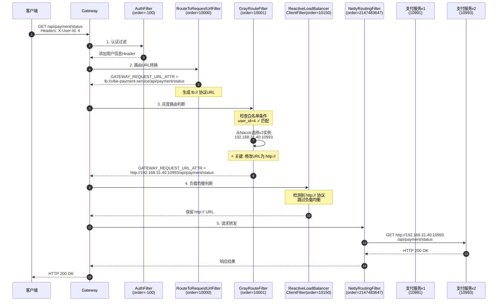
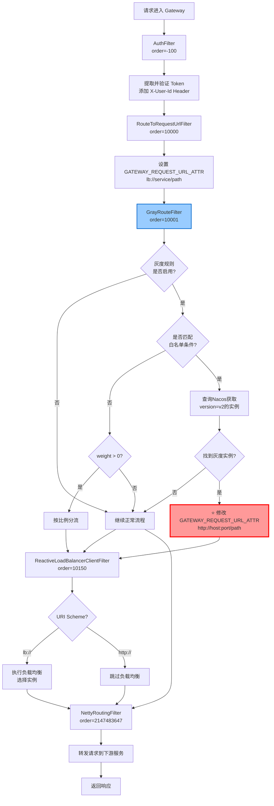

# Gateway 灰度路由完整文档

## 一、核心原理

本方案采用**双层灰度路由机制**：

### 1.1 双层路由架构

```
┌─────────────────────────────────────────────────────────────────────────┐
│                           请求进入 Gateway                               │
└─────────────────────────────────────────────────────────────────────────┘
                                    │
                                    ▼
┌─────────────────────────────────────────────────────────────────────────┐
│  第一层：GrayRouteFilter (order=10001)                                   │
│  ┌───────────────────────────────────────────────────────────────────┐  │
│  │  • 判断是否是灰度请求（白名单 + 权重）                               │  │
│  │  • 灰度请求：改写 URI 为 http://v2-instance，直接路由到 v2          │  │
│  │  • 非灰度请求：将灰度标记写入 Reactor Context                        │  │
│  └───────────────────────────────────────────────────────────────────┘  │
└─────────────────────────────────────────────────────────────────────────┘
                                    │
                    ┌───────────────┴───────────────┐
                    │                               │
                    ▼                               ▼
┌─────────────────────────────────┐    ┌─────────────────────────────────┐
│  灰度请求（30%）                  │    │  非灰度请求（70%）                │
│  URI: http://v2:10993/xxx       │    │  URI: lb://service/xxx          │
│  ↓ 跳过 LoadBalancer            │    │  ↓ 进入 LoadBalancer            │
└─────────────────────────────────┘    └─────────────────────────────────┘
                    │                               │
                    │                               ▼
                    │           ┌─────────────────────────────────────────┐
                    │           │  第二层：GrayServiceInstanceListSupplier │
                    │           │  ┌───────────────────────────────────┐  │
                    │           │  │  • 从 Reactor Context 读取灰度标记  │  │
                    │           │  │  • 非灰度请求：过滤实例列表，只保留 v1 │  │
                    │           │  │  • 返回 v1 实例列表给 LoadBalancer   │  │
                    │           │  └───────────────────────────────────┘  │
                    │           └─────────────────────────────────────────┘
                    │                               │
                    │                               ▼
                    │           ┌─────────────────────────────────────────┐
                    │           │  RoundRobinLoadBalancer                 │
                    │           │  在 v1 实例列表中选择                     │
                    │           └─────────────────────────────────────────┘
                    │                               │
                    └───────────────┬───────────────┘
                                    │
                                    ▼
┌─────────────────────────────────────────────────────────────────────────┐
│  最终结果：                                                              │
│  • 30% 流量 → v2 实例（灰度）                                            │
│  • 70% 流量 → v1 实例（正常）                                            │
│  非灰度用户 100% 不会访问到 v2！                                          │
└─────────────────────────────────────────────────────────────────────────┘
```

### 1.2 核心组件

| 组件 | 作用 | 位置 |
|------|------|------|
| **GrayRouteFilter** | 判断灰度请求，直接路由灰度流量到 v2 | Gateway Filter (order=10001) |
| **GrayServiceInstanceListSupplier** | 过滤非灰度请求的实例列表，只返回 v1 | LoadBalancer 层 |
| **GrayLoadBalancerConfiguration** | 配置自定义的 LoadBalancer | Spring Configuration |

### 1.3 解决的问题

**传统方案的缺陷**：
- 灰度请求改写 URI 直接路由到 v2 ✓
- 非灰度请求走默认 LB，LB 会平均分配到 v1 和 v2 ✗
- 结果：70% 非灰度流量中，35% 还是会到 v2

**新方案的优势**：
- 灰度请求：GrayRouteFilter 直接路由到 v2（30%）
- 非灰度请求：GrayServiceInstanceListSupplier 过滤掉 v2 实例，只返回 v1 实例给 LB
- 结果：非灰度用户 100% 访问 v1，灰度用户 100% 访问 v2

***

## 二、Gateway 自带 Filter 执行顺序（必须了解）

### 2.1 关键 Filter 及其 Order

| Filter 名称                            | Order      | 作用                              | 是否可干预      |
| ------------------------------------ | ---------- | ------------------------------- | ---------- |
| **AuthFilter** (自定义)                 | -100       | 认证、添加请求头                        | ✓          |
| **RouteToRequestUrlFilter**          | 10000      | 将路由 URI 转换为 `lb://service/path` | ✓          |
| **GrayRouteFilter** (自定义)            | 10001      | **灰度路由干预**                      | ✓          |
| **ReactiveLoadBalancerClientFilter** | 10150      | 负载均衡选择实例                        | ✗ (之后无法干预) |
| **NettyRoutingFilter**               | 2147483647 | 实际转发请求到下游                       | ✗          |

### 2.2 为什么必须在 10000 之后、10150 之前？

```
┌─────────────────────────────────────────────────────────────────┐
│  请求进入 Gateway                                                │
└─────────────────────────────────────────────────────────────────┘
                              ↓
┌─────────────────────────────────────────────────────────────────┐
│  AuthFilter (order=-100)                                         │
│  ├── 验证 Token                                                  │
│  ├── 添加 X-User-Id Header                                       │
│  └── 返回新的 exchange (包含用户信息)                             │
└─────────────────────────────────────────────────────────────────┘
                              ↓
┌─────────────────────────────────────────────────────────────────┐
│  RouteToRequestUrlFilter (order=10000) ⭐ 关键                   │
│  ├── 根据 Route 配置生成请求 URL                                  │
│  ├── 设置 GATEWAY_REQUEST_URL_ATTR = lb://service/path           │
│  └── 此时 URI 是 lb:// 协议，需要负载均衡                         │
└─────────────────────────────────────────────────────────────────┘
                              ↓
┌─────────────────────────────────────────────────────────────────┐
│  GrayRouteFilter (order=10001) ⭐ 灰度干预点                     │
│  ├── 读取 GATEWAY_REQUEST_URL_ATTR                               │
│  ├── 判断是否是灰度请求                                          │
│  ├── 选择灰度实例 (192.168.31.40:10993)                          │
│  └── 修改 GATEWAY_REQUEST_URL_ATTR = http://host:port/path       │
│      └── 使用 http:// 前缀，跳过负载均衡                          │
└─────────────────────────────────────────────────────────────────┘
                              ↓
┌─────────────────────────────────────────────────────────────────┐
│  ReactiveLoadBalancerClientFilter (order=10150) ⭐ 分水岭        │
│  ├── 检查 GATEWAY_REQUEST_URL_ATTR                               │
│  ├── 如果是 lb:// 协议 → 执行负载均衡选择实例                     │
│  └── 如果是 http:// 协议 → 跳过负载均衡                           │
│      └── 我们的灰度路由生效！                                     │
└─────────────────────────────────────────────────────────────────┘
                              ↓
┌─────────────────────────────────────────────────────────────────┐
│  NettyRoutingFilter (order=2147483647)                           │
│  ├── 读取 GATEWAY_REQUEST_URL_ATTR                               │
│  └── 转发 HTTP 请求到下游服务                                     │
│      └── 此时 URI 已经是 http://192.168.31.40:10993/xxx          │
└─────────────────────────────────────────────────────────────────┘
                              ↓
┌─────────────────────────────────────────────────────────────────┐
│  支付服务 (10993) 收到请求                                       │
└─────────────────────────────────────────────────────────────────┘
```

### 2.3 干预点分析

```
时间轴 ───────────────────────────────────────────────────────────────►

-100    10000      10001      10150      2147483647
  │        │          │          │            │
  ▼        ▼          ▼          ▼            ▼
Auth   RouteTo    GrayRoute   LoadBalancer  Netty
Filter  Url       Filter      ClientFilter  Routing
        Filter

        │          │          │            │
        └──────────┴──────────┘            │
              可干预区域                    │
        (修改 GATEWAY_REQUEST_URL_ATTR)    │
                                          │
                               不可干预 (已确定目标)
```

**关键理解**：

- **10000 之前**：`GATEWAY_REQUEST_URL_ATTR` 还未设置，无法干预
- **10000-10150 之间**：`GATEWAY_REQUEST_URL_ATTR` 已设置（lb://），可以修改
- **10150 之后**：负载均衡已完成，无法干预路由

***

## 三、核心配置（不能遗漏）

### 3.1 支付服务配置（application.yml）

```yaml
spring:
  cloud:
    nacos:
      discovery:
        metadata:
          version: ${SERVICE_VERSION:v1}  # 关键：实例版本标签
```

**关键点**：

- 正常节点：`SERVICE_VERSION=v1`（默认）
- 灰度节点：`SERVICE_VERSION=v2`（启动时指定）

### 3.2 Nacos 灰度规则配置（gray-rules.yaml）

```yaml
gray:
  rules:
    - service: vibe-payment-service  # 服务名
      enabled: true                  # 启用灰度
      version: v2                    # 灰度版本号
      weight: 0                      # 非白名单用户按此比例分流（0表示不分流）
      conditions:                    # 白名单条件（同时满足）
        - type: user_id
          operator: in
          values: ["4", "1001", "1002", "1003"]
        - type: ip
          operator: regex
          values: ["192\\.168\\.1\\..*", "127\\.0\\.0\\.1"]
```

**关键点**：

- `version` 必须与服务实例的 metadata.version 匹配
- `conditions` 是白名单条件，同时满足才走灰度
- `weight` 用于非白名单用户的比例分流

### 3.3 Gateway 过滤器（核心代码）

```java
@Component
public class GrayRouteFilter implements GlobalFilter, Ordered {

    @Override
    public int getOrder() {
        // 必须在 ReactiveLoadBalancerClientFilter(10150) 之前
        // 必须在 RouteToRequestUrlFilter(10000) 之后
        return 10001;
    }

    @Override
    public Mono<Void> filter(ServerWebExchange exchange, GatewayFilterChain chain) {
        // 1. 获取灰度规则
        GrayRuleConfig.GrayRule rule = grayRuleManager.getRule(serviceId);
        if (rule == null || !rule.isEnabled()) {
            return chain.filter(exchange);
        }

        // 2. 判断是否是灰度请求
        boolean isGrayRequest = grayRuleManager.shouldRouteToGray(exchange, serviceId);

        if (isGrayRequest) {
            // 3. 选择灰度实例
            ServiceInstance instance = serviceInstanceSelector.selectInstance(serviceId, rule.getVersion());

            if (instance != null) {
                // 4. 构建灰度 URI
                URI grayUri = URI.create(String.format("http://%s:%d%s",
                        instance.getHost(), instance.getPort(), path));

                // 5. 关键：修改 GATEWAY_REQUEST_URL_ATTR
                // 使用 http:// 前缀，ReactiveLoadBalancerClientFilter 会自动跳过
                exchange.getAttributes().put(GATEWAY_REQUEST_URL_ATTR, grayUri);
            }
        }

        return chain.filter(exchange);
    }
}
```

**关键点**：

- `order = 10001`：必须在 `ReactiveLoadBalancerClientFilter`(10150) 之前
- 修改 `GATEWAY_REQUEST_URL_ATTR`：将 `lb://` 改为 `http://`
- **不要设置** **`GATEWAY_ALREADY_ROUTED_ATTR`**：这会阻止 NettyRoutingFilter 转发请求

### 3.4 支付服务启动命令

**正常节点（v1）**：

```bash
java -jar vibe-payment-service.jar --server.port=10991
```

**灰度节点（v2）**：

```bash
SERVICE_VERSION=v2 java -jar vibe-payment-service.jar --server.port=10993
```

***

## 四、完整执行流程图

### 4.1 过滤器执行顺序时序图



### 4.2 灰度路由决策流程图



### 4.3 过滤器链干预点分析

```mermaid
gantt
    title Gateway Filter 执行时间轴
    dateFormat X
    axisFormat %s

    section Filter Chain
    AuthFilter           :a1, 0, 10
    RouteToRequestUrlFilter :a2, 10000, 10010
    GrayRouteFilter      :crit, a3, 10001, 10011
    ReactiveLoadBalancerClientFilter :a4, 10150, 10160
    NettyRoutingFilter   :a5, 2147483647, 2147483657

    section 可干预区域
    修改 GATEWAY_REQUEST_URL_ATTR :crit, 10000, 10150
```



### 4.4 URI 变化状态图

```mermaid
stateDiagram-v2
    [*] --> 原始请求 : 客户端请求

    原始请求 --> 认证后 : AuthFilter
    认证后 --> 路由URL : RouteToRequestUrlFilter

    路由URL : GATEWAY_REQUEST_URL_ATTR
    路由URL : lb://vibe-payment-service/api/payment/status

    路由URL --> 灰度判断 : GrayRouteFilter

    state 灰度判断 {
        [*] --> 检查规则
        检查规则 --> 匹配白名单 : 是灰度用户
        检查规则 --> 正常流程 : 非灰度用户
        匹配白名单 --> 查询实例 : 从Nacos筛选
        查询实例 --> 构建灰度URL : 选中v2实例
    }

    构建灰度URL : GATEWAY_REQUEST_URL_ATTR
    构建灰度URL : http://192.168.31.40:10993/api/payment/status

    构建灰度URL --> 负载均衡判断 : ReactiveLoadBalancerClientFilter
    正常流程 --> 负载均衡判断

    state 负载均衡判断 {
        [*] --> 检查Scheme
        检查Scheme --> 执行LB : lb://
        检查Scheme --> 跳过LB : http://
    }

    执行LB : 选择v1或v2实例
    跳过LB : 使用已指定的实例

    执行LB --> 最终URL
    跳过LB --> 最终URL

    最终URL : http://host:port/path
    最终URL --> 请求转发 : NettyRoutingFilter
    请求转发 --> [*]

    style 构建灰度URL fill:#ff9999
    style 跳过LB fill:#99ff99
```

### 4.5 灰度规则匹配流程

```mermaid
flowchart LR
    A[灰度请求] --> B[提取请求信息]
    B --> C[UserId: 4]
    B --> D[IP: 127.0.0.1]
    B --> E[Header...]

    C --> F[规则匹配引擎]
    D --> F
    E --> F

    subgraph 灰度规则配置
        R1[user_id in [4,1001,1002,1003]]
        R2[ip regex [192.168.1.*,127.0.0.1]]
        R3[weight: 0]
    end

    F --> G{AND条件<br/>全部满足?}
    R1 --> G
    R2 --> G

    G -->|是| H[命中白名单<br/>强制路由到v2]
    G -->|否| I{weight > 0?}
    R3 --> I

    I -->|是| J[按比例分流<br/>v1/v2]
    I -->|否| K[路由到v1]

    H --> L[返回灰度实例<br/>192.168.31.40:10993]
    J --> M[根据比例选择]
    K --> N[返回正常实例]

    style H fill:#ff9999
    style L fill:#99ccff
```

***

## 五、常见错误与解决方案

### 5.1 设置了 `GATEWAY_ALREADY_ROUTED_ATTR`

**错误代码**:

```java
exchange.getAttributes().put(GATEWAY_ALREADY_ROUTED_ATTR, true);
```

**现象**: 接口无响应，请求无法到达下游服务

**原因**: `NettyRoutingFilter` 检查到此标记会跳过转发

**解决**: 不要设置此标记

### 5.2 Order 顺序错误

**错误代码**:

```java
public int getOrder() {
    return 10160; // 在 ReactiveLoadBalancerClientFilter 之后
}
```

**现象**: 灰度路由不生效，请求随机路由到 v1/v2

**原因**: 负载均衡已完成，无法干预

**解决**: 设置为 10001（10000 之后，10150 之前）

### 5.3 版本标签不匹配

**错误配置**:

- Nacos: `version: v2`
- 支付服务: `SERVICE_VERSION=gray` (不是 v2)

**现象**: 灰度请求找不到实例，fallback 到正常节点

**解决**: 确保版本标签完全一致

***

## 六、验证方式

1. **白名单用户**：请求头 `X-User-Id: 4`，会被路由到 v2 节点
2. **非白名单用户**：按 `weight` 比例分流到 v1 或 v2
3. **查看日志**：`[GrayRouteFilter] Gray route: vibe-payment-service -> 192.168.31.40:10993`

***

## 七、核心代码（最简版）

```java
@Component
public class GrayRouteFilter implements GlobalFilter, Ordered {

    @Autowired
    private GrayRuleManager grayRuleManager;
    
    @Autowired
    private ServiceInstanceSelector serviceInstanceSelector;

    @Override
    public int getOrder() {
        return 10001; // 10000 之后，10150 之前
    }

    @Override
    public Mono<Void> filter(ServerWebExchange exchange, GatewayFilterChain chain) {
        String serviceId = getServiceId(exchange);
        GrayRuleConfig.GrayRule rule = grayRuleManager.getRule(serviceId);
        
        if (rule == null || !rule.isEnabled()) {
            return chain.filter(exchange);
        }

        // 判断灰度
        if (grayRuleManager.shouldRouteToGray(exchange, serviceId)) {
            ServiceInstance instance = serviceInstanceSelector.selectInstance(serviceId, rule.getVersion());
            
            if (instance != null) {
                URI uri = exchange.getAttribute(GATEWAY_REQUEST_URL_ATTR);
                URI grayUri = URI.create(String.format("http://%s:%d%s",
                        instance.getHost(), instance.getPort(), uri.getPath()));
                
                // 核心：修改 URI
                exchange.getAttributes().put(GATEWAY_REQUEST_URL_ATTR, grayUri);
            }
        }

        return chain.filter(exchange);
    }
}
```
