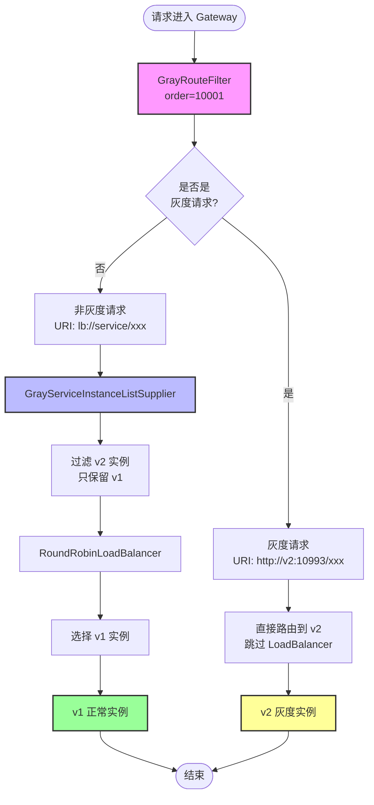
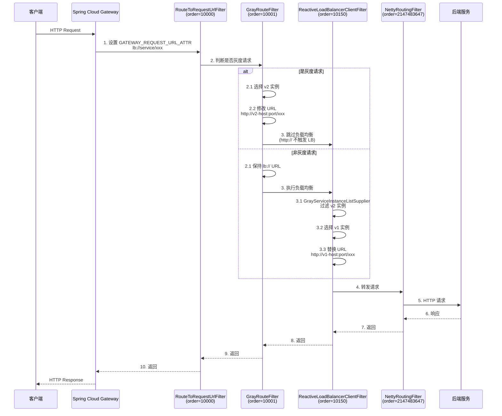
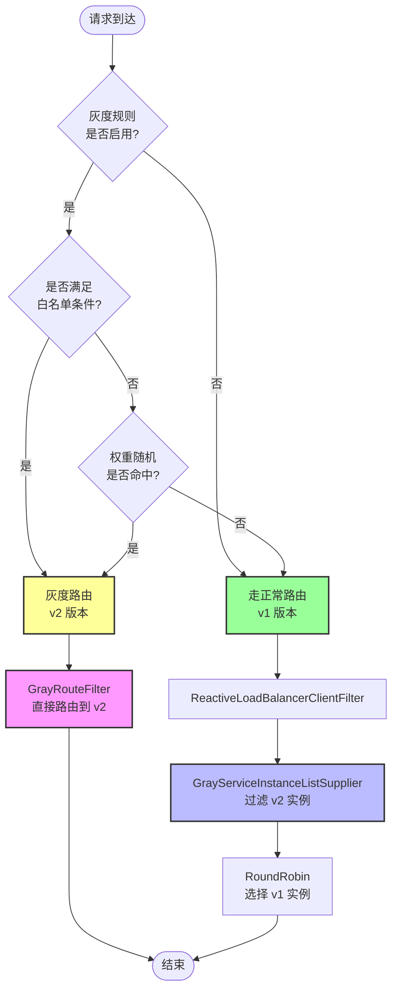
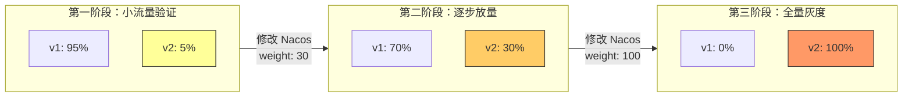
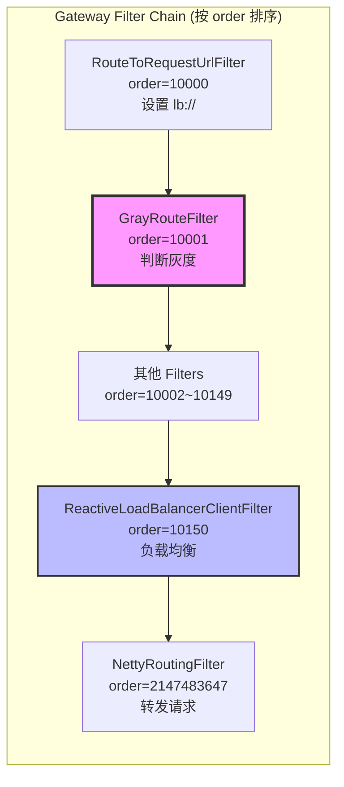
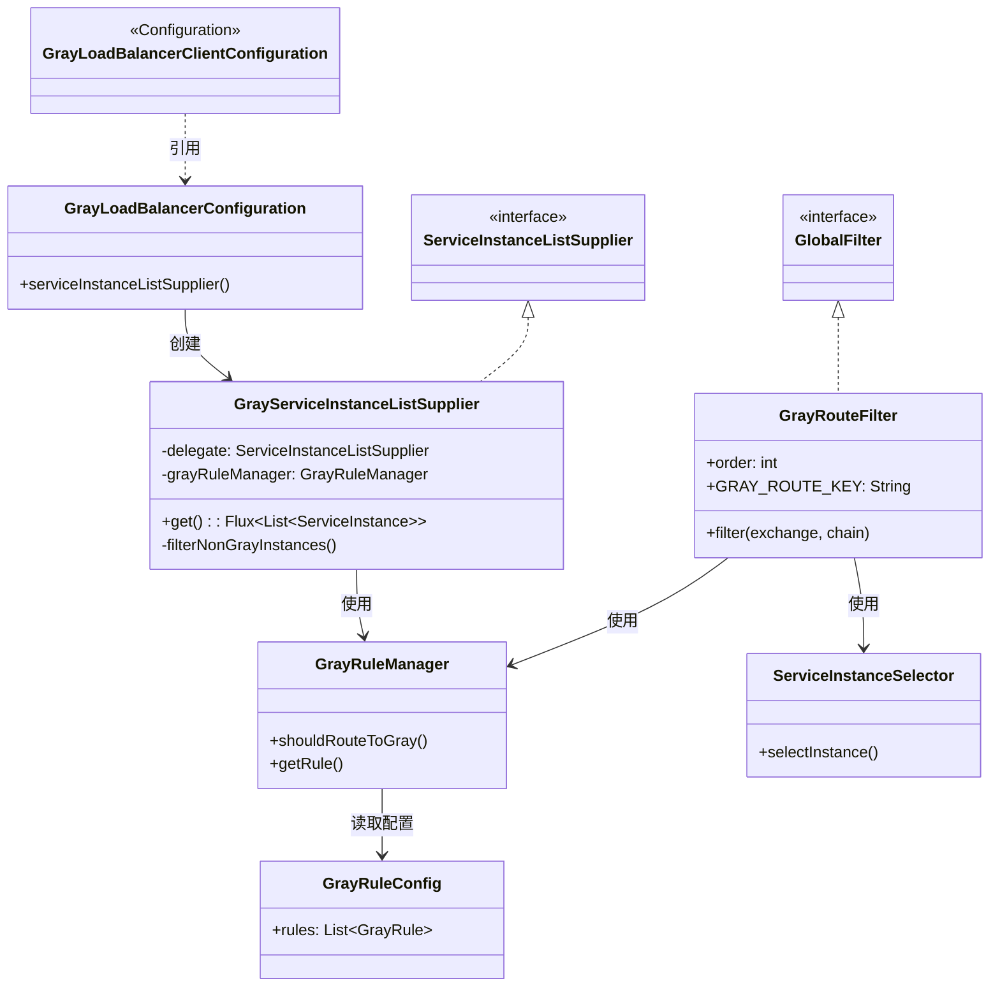
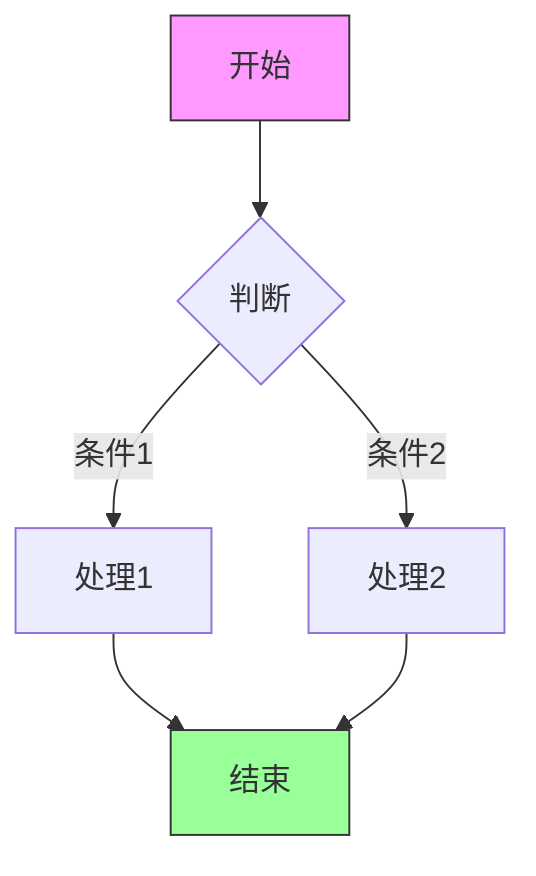
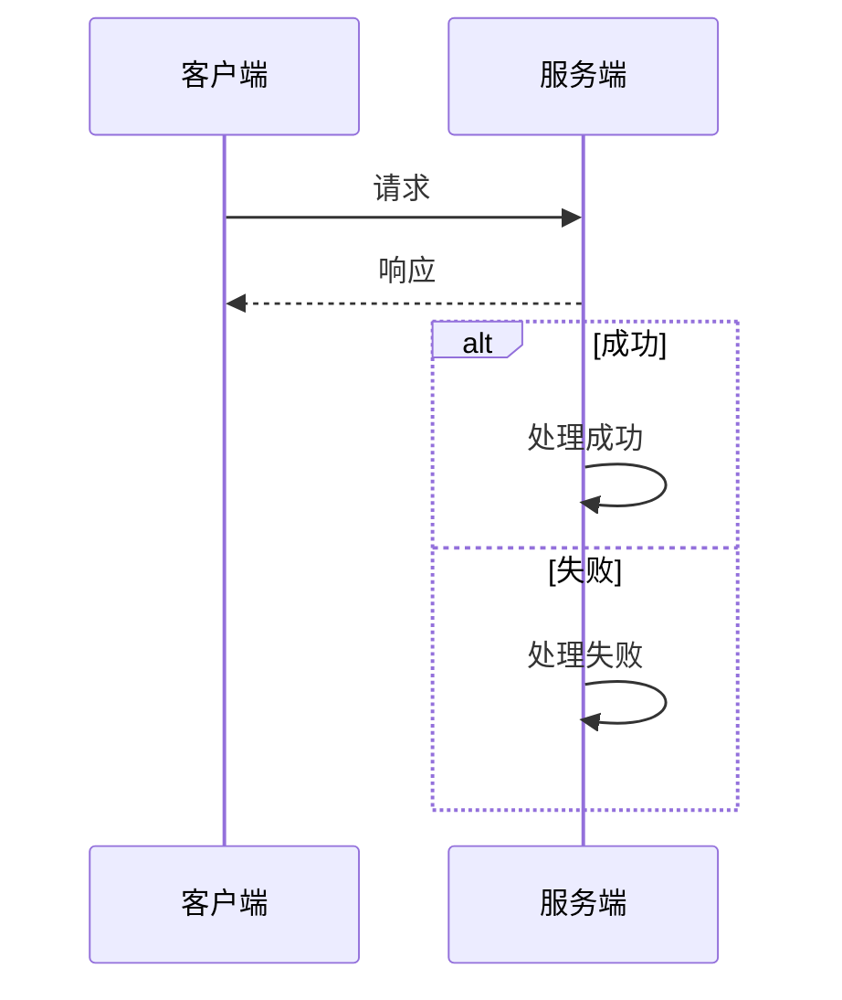
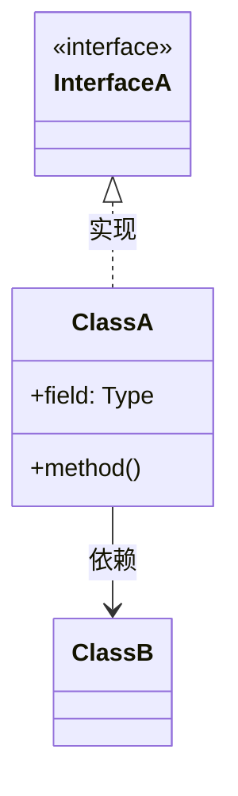

# 灰度与非灰度服务隔离方案

## 一、方案概述

本方案实现了基于 Spring Cloud Gateway + Nacos 的灰度发布功能，核心目标是：

- **灰度请求**：按配置比例（如 30%）路由到灰度版本（v2）实例
- **非灰度请求**：100% 路由到正常版本（v1）实例，**绝不访问灰度实例**
- **不停机放量**：支持动态调整流量比例，无需重启服务

## 二、核心原理

### 2.1 双层路由架构

**ASCII 流程图：**

```
┌─────────────────────────────────────────────────────────────────────────┐
│                           请求进入 Gateway                               │
└─────────────────────────────────────────────────────────────────────────┘
                                    │
                                    ▼
┌─────────────────────────────────────────────────────────────────────────┐
│  第一层：GrayRouteFilter (order=10001)                                   │
│  ┌───────────────────────────────────────────────────────────────────┐  │
│  │  • 判断是否是灰度请求（白名单 + 权重）                               │  │
│  │  • 灰度请求：改写 URI 为 http://v2-instance，直接路由到 v2          │  │
│  │  • 非灰度请求：保持 lb:// 协议，进入 LoadBalancer                   │  │
│  └───────────────────────────────────────────────────────────────────┘  │
└─────────────────────────────────────────────────────────────────────────┘
                                    │
                    ┌───────────────┴───────────────┐
                    │                               │
                    ▼                               ▼
┌─────────────────────────────────┐    ┌─────────────────────────────────┐
│  灰度请求（30%）                  │    │  非灰度请求（70%）                │
│  URI: http://v2:10993/xxx       │    │  URI: lb://service/xxx          │
│  ↓ 跳过 LoadBalancer            │    │  ↓ 进入 ReactiveLoadBalancer   │
└─────────────────────────────────┘    └─────────────────────────────────┘
                    │                               │
                    │                               ▼
                    │           ┌─────────────────────────────────────────┐
                    │           │  第二层：GrayServiceInstanceListSupplier │
                    │           │  ┌───────────────────────────────────┐  │
                    │           │  │  • 从 Reactor Context 读取灰度标记  │  │
                    │           │  │  • 非灰度请求：过滤实例列表，只保留 v1 │  │
                    │           │  │  • 返回 v1 实例列表给 LoadBalancer   │  │
                    │           │  └───────────────────────────────────┘  │
                    │           └─────────────────────────────────────────┘
                    │                               │
                    │                               ▼
                    │           ┌─────────────────────────────────────────┐
                    │           │  RoundRobinLoadBalancer                 │
                    │           │  在 v1 实例列表中选择                     │
                    │           └─────────────────────────────────────────┘
                    │                               │
                    └───────────────┬───────────────┘
                                    │
                                    ▼
┌─────────────────────────────────────────────────────────────────────────┐
│  最终结果：                                                              │
│  • 30% 流量 → v2 实例（灰度）                                            │
│  • 70% 流量 → v1 实例（正常）                                            │
│  非灰度用户 100% 不会访问到 v2！                                          │
└─────────────────────────────────────────────────────────────────────────┘
```

**Mermaid 流程图（供学习）：**



### 2.2 关键组件

| 组件 | 作用 | 位置 |
|------|------|------|
| **GrayRouteFilter** | 判断灰度请求，直接路由灰度流量到 v2 | Gateway Filter (order=10001) |
| **GrayServiceInstanceListSupplier** | 过滤非灰度请求的实例列表，只返回 v1 | LoadBalancer 层 |
| **GrayLoadBalancerConfiguration** | 配置自定义的 LoadBalancer | Spring Configuration |

### 2.3 Gateway Filter 执行顺序（Mermaid 时序图）



## 三、核心代码

### 3.1 GrayRouteFilter

```java
@Component
public class GrayRouteFilter implements GlobalFilter, Ordered {

    public static final String GRAY_ROUTE_KEY = "GRAY_ROUTE";

    @Override
    public int getOrder() {
        // 必须在 ReactiveLoadBalancerClientFilter(10150) 之前
        // 必须在 RouteToRequestUrlFilter(10000) 之后
        return 10001;
    }

    @Override
    public Mono<Void> filter(ServerWebExchange exchange, GatewayFilterChain chain) {
        // 1. 获取灰度规则
        GrayRuleConfig.GrayRule rule = grayRuleManager.getRule(serviceId);
        if (rule == null || !rule.isEnabled()) {
            return chain.filter(exchange);
        }

        // 2. 判断是否是灰度请求
        boolean isGrayRequest = grayRuleManager.shouldRouteToGray(exchange, serviceId);

        if (isGrayRequest) {
            // 3. 选择灰度实例
            ServiceInstance instance = serviceInstanceSelector.selectInstance(serviceId, rule.getVersion());

            if (instance != null) {
                // 4. 构建灰度 URI
                URI grayUri = URI.create(String.format("http://%s:%d%s",
                        instance.getHost(), instance.getPort(), path));

                // 5. 关键：修改 GATEWAY_REQUEST_URL_ATTR
                // 使用 http:// 前缀，ReactiveLoadBalancerClientFilter 会自动跳过负载均衡
                exchange.getAttributes().put(GATEWAY_REQUEST_URL_ATTR, grayUri);
            }
        }

        // 将灰度标记写入 Reactor Context
        return chain.filter(exchange)
                .contextWrite(ctx -> ctx.put(GRAY_ROUTE_KEY, isGrayRequest));
    }
}
```

### 3.2 GrayServiceInstanceListSupplier

```java
public class GrayServiceInstanceListSupplier implements ServiceInstanceListSupplier {

    private final ServiceInstanceListSupplier delegate;
    private final GrayRuleManager grayRuleManager;

    @Override
    public Flux<List<ServiceInstance>> get() {
        String serviceId = getServiceId();
        
        // 获取灰度规则
        GrayRuleConfig.GrayRule rule = grayRuleManager.getRule(serviceId);
        if (rule == null || !rule.isEnabled()) {
            // 无灰度规则，直接返回委托的实例列表
            return delegate.get();
        }
        
        // 从 Reactor Context 获取灰度标记
        return Flux.deferContextual(ctx -> {
            Boolean isGrayRoute = ctx.getOrDefault(GrayRouteFilter.GRAY_ROUTE_KEY, false);
            
            return delegate.get().map(instances -> {
                if (isGrayRoute) {
                    // 灰度请求：返回所有实例（由 GrayRouteFilter 处理）
                    return instances;
                } else {
                    // 非灰度请求：只返回非灰度版本（v1）的实例
                    return filterNonGrayInstances(instances, rule);
                }
            });
        });
    }

    private List<ServiceInstance> filterNonGrayInstances(List<ServiceInstance> instances, 
                                                         GrayRuleConfig.GrayRule rule) {
        String grayVersion = rule.getVersion();
        
        return instances.stream()
                .filter(instance -> {
                    String instanceVersion = instance.getMetadata().get("version");
                    // 排除灰度版本的实例
                    return instanceVersion == null || !instanceVersion.equals(grayVersion);
                })
                .collect(Collectors.toList());
    }
}
```

### 3.3 GrayLoadBalancerConfiguration

```java
@Configuration(proxyBeanMethods = false)
public class GrayLoadBalancerConfiguration {

    @Bean
    public ServiceInstanceListSupplier serviceInstanceListSupplier(
            ConfigurableApplicationContext context,
            GrayRuleManager grayRuleManager,
            Environment environment) {

        String serviceId = environment.getProperty(LoadBalancerClientFactory.PROPERTY_NAME);
        if (serviceId == null) {
            serviceId = environment.getProperty("spring.application.name");
        }

        // 使用 Builder 构建默认的 Supplier 链
        ServiceInstanceListSupplier delegate = ServiceInstanceListSupplier.builder()
                .withDiscoveryClient()
                .withCaching()
                .build(context);

        // 包装灰度过滤器
        return new GrayServiceInstanceListSupplier(delegate, grayRuleManager);
    }
}
```

## 四、配置方式

### 4.1 支付服务配置（application.yml）

```yaml
spring:
  cloud:
    nacos:
      discovery:
        metadata:
          version: ${SERVICE_VERSION:v1}  # 关键：实例版本标签
```

**关键点**：
- 正常节点：`SERVICE_VERSION=v1`（默认）
- 灰度节点：`SERVICE_VERSION=v2`（启动时指定）

### 4.2 Nacos 灰度规则配置（gray-rules.yaml）

```yaml
gray:
  rules:
    - service: vibe-payment-service  # 服务名
      enabled: true                  # 启用灰度
      version: v2                    # 灰度版本号
      weight: 30                     # 非白名单用户按此比例分流（0表示不分流）
      conditions:                    # 白名单条件（同时满足）
        - type: user_id
          operator: in
          values: ["4", "1001", "1002", "1003"]
        - type: ip
          operator: regex
          values: ["192\\.168\\.1\\..*", "127\\.0\\.0\\.1"]
```

**关键点**：
- `version` 必须与服务实例的 metadata.version 匹配
- `conditions` 是白名单条件，同时满足才走灰度
- `weight` 用于非白名单用户的比例分流

### 4.3 Gateway 全局配置

```java
@Configuration(proxyBeanMethods = false)
@LoadBalancerClients(defaultConfiguration = GrayLoadBalancerConfiguration.class)
public class GrayLoadBalancerClientConfiguration {
    // 使用 @LoadBalancerClients 注解为所有服务启用灰度配置
}
```

## 五、流量分配逻辑

| 用户类型 | 目标版本 | 实现方式 |
|---------|---------|---------|
| 白名单用户 | v2 (100%) | GrayRouteFilter 直接路由 |
| 灰度权重用户 (30%) | v2 (30%) | GrayRouteFilter 直接路由 |
| 非灰度用户 (70%) | v1 (100%) | GrayServiceInstanceListSupplier 过滤 |

**Mermaid 灰度判断流程图：**



## 六、不停机放量流程

```yaml
# 第一阶段：小流量验证
gray:
  rules:
    - service: vibe-payment-service
      weight: 5           # 5% 流量到 v2

# 第二阶段：逐步放量（修改 Nacos 配置，无需重启）
gray:
  rules:
    - service: vibe-payment-service
      weight: 30          # 30% 流量到 v2

# 第三阶段：全量灰度
gray:
  rules:
    - service: vibe-payment-service
      weight: 100         # 100% 流量到 v2
```

**Mermaid 放量流程图：**



## 七、关键问题与解决

### 7.1 为什么需要双层路由？

**问题**：如果只用 GrayRouteFilter 处理灰度请求，非灰度请求走默认 LB，LB 会平均分配到 v1 和 v2。

**解决**：
- 灰度请求：GrayRouteFilter 直接路由到 v2（30%）
- 非灰度请求：GrayServiceInstanceListSupplier 过滤掉 v2 实例，只返回 v1（70%）

### 7.2 为什么 GrayRouteFilter 的 order 是 10001？

| Filter | Order | 作用 |
|--------|-------|------|
| RouteToRequestUrlFilter | 10000 | 设置 GATEWAY_REQUEST_URL_ATTR = lb:// |
| **GrayRouteFilter** | **10001** | **修改 GATEWAY_REQUEST_URL_ATTR** |
| ReactiveLoadBalancerClientFilter | 10150 | 负载均衡选择实例 |

必须在 10000 之后（URI 已设置），10150 之前（LB 未执行）。

**Mermaid Filter 执行顺序图：**



### 7.3 为什么使用 http:// 而不是 lb://？

- `lb://`：触发负载均衡，会平均分配到所有实例
- `http://`：直接指定实例，跳过负载均衡

GrayRouteFilter 将 `lb://vibe-payment-service` 改为 `http://v2-host:port`，直接路由到灰度实例。

## 八、文件清单

| 文件 | 说明 |
|------|------|
| GrayRouteFilter.java | 灰度路由过滤器，判断并路由灰度请求 |
| GrayServiceInstanceListSupplier.java | 灰度服务实例列表供应器，过滤非灰度实例 |
| GrayLoadBalancerConfiguration.java | 灰度负载均衡配置 |
| GrayLoadBalancerClientConfiguration.java | 灰度负载均衡客户端配置（入口） |
| GrayRuleManager.java | 灰度规则管理器 |
| GrayRuleConfig.java | 灰度规则配置类 |
| ServiceInstanceSelector.java | 服务实例选择器 |

**Mermaid 类关系图：**



## 九、总结

本方案通过 **GrayRouteFilter + GrayServiceInstanceListSupplier** 的双层架构，实现了：

1. ✅ **精确流量控制**：30% 到 v2，70% 到 v1
2. ✅ **非灰度用户隔离**：100% 不会访问灰度实例
3. ✅ **不停机放量**：动态调整 weight，无需重启
4. ✅ **白名单支持**：特定用户强制走灰度
5. ✅ **与框架兼容**：保留 Spring Cloud LoadBalancer 默认功能

---

## 附录：Mermaid 语法速查表

本文档中使用的 Mermaid 图表类型：

### 1. Flowchart（流程图）



**常用语法：**
- `flowchart TD` - 从上到下 (Top Down)
- `flowchart LR` - 从左到右 (Left Right)
- `A[文本]` - 矩形节点
- `A{文本}` - 菱形判断节点
- `A([文本])` - 圆角开始/结束节点
- `A --> B` - 箭头连接
- `A -->|标签| B` - 带标签的箭头
- `style A fill:#f9f` - 设置节点样式

### 2. Sequence Diagram（时序图）



**常用语法：**
- `participant A as 名称` - 定义参与者
- `A->>B: 消息` - 实线箭头（发送消息）
- `A-->>B: 消息` - 虚线箭头（返回消息）
- `alt 条件` - 条件分支
- `loop 循环` - 循环

### 3. Class Diagram（类图）



**常用语法：**
- `class 类名` - 定义类
- `<<interface>>` - 标记为接口
- `+` - public, `-` - private
- `ClassA <|.. ClassB` - 实现关系
- `ClassA --> ClassB` - 依赖关系
- `ClassA --|> ClassB` - 继承关系

更多语法请参考 [Mermaid 官方文档](https://mermaid.js.org/)
